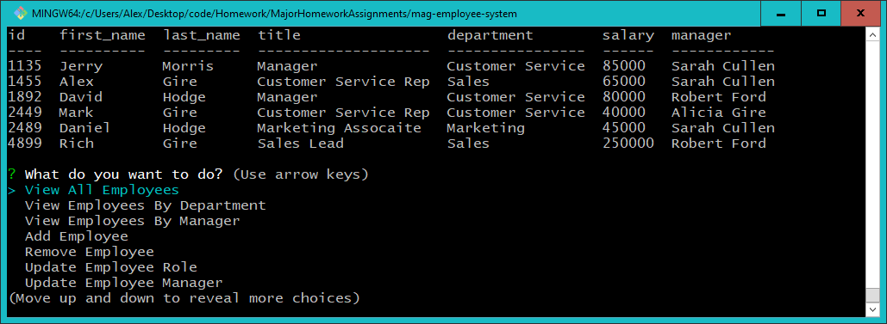

<h2>Employee Management System</h2> 
 
[https://github.com/magire01/mag-employee-system/](https://github.com/magire01/mag-employee-system)
 

 

 
<h5> Known Issues</h5>
<ul> This app only uses one database. Will need to divide into 3 databases and use join queries </ul>
<ul> User can put incorrect values into inquirer inputs - need validations</ul>
<ul> If the manager field is changed and no other row has that manager, it disappears from the prompt options in "Update Employee Manager" </ul>

This app allows the user to view, add, remove employees and update their manager/role. The user's input to the prompts will determine how the data is filtered, updated, added, or removed. 

 <h5>Table of Contents:</h5>
  <li> Installation Details </li>
  <li> Usage </li>
  <li> Contribute </li>
  <li> Author </li>
 
 Installation Details: 
 This is a Node app that uses NPMs inquirer, mySQL, and console.table. Install the required npms and then you can use the command "node manage.js" to start the app.

 Usage:
 When the app is ran (using node manage.js), the user will be prompted with the the option to "View Employees", "View Employees by Department", "View Employees by Manager", "Add Employee", "Remove Employee", "Update Employee Role", "Update Employee Manager" and "Exit". Once one of these is selected, the user will be prompted with additional questions to complete the query. Once the query is completed, the user will be prompted with the original questions to do something else in the app. Select "Exit" to exit the app.

 Contribute:
 Please feel free to make suggestions and changes to this app to make it more user friendly!

Author: Mark Gire

  